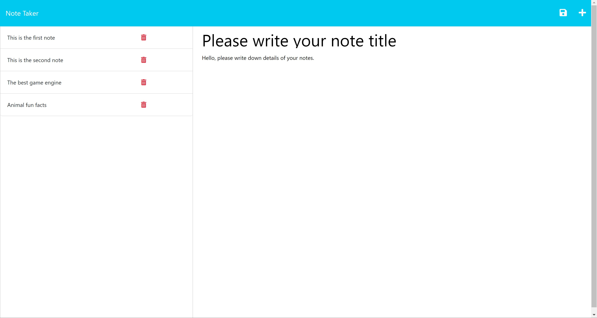

# Note Taker Starter Code
 

## Description

This application takes notes and save them in a local database. 

## Table of Contents

- [Installation](#installation)
- [Usage](#usage)
- [Credits](#credits)
- [License](#license)
- [How to Contribute](#how%20to%20contribute)
- [Tests](#tests)

## Installation

N/A

## Usage

You can start taking notes by hiting the 'plus' icon and writing down a note title and descriptions. Hit the 'save' icon to save a note in the database. Hit the 'delete' icon to delete a note.

## Credits

Credit to Coding Bootcamp. Souce code: https://github.com/coding-boot-camp/miniature-eureka.git

## License
[MIT](https://opensource.org/licenses/MIT)

## How to Contribute

N/A

## Tests

N/A